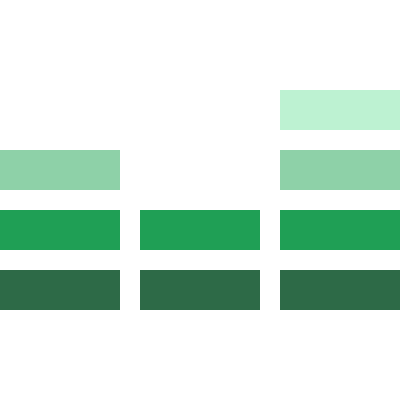

Mantis Equalizr
===============

> A small set of useful rules to complement resets and normalizers

  

---

Documentation
-------------

The documentation isn't ready yet, but you can read the code. Have fun!

License
-------

© 2016 [Acauã Montiel](http://acauamontiel.com.br)

[MIT License](http://acaua.mit-license.org/)
